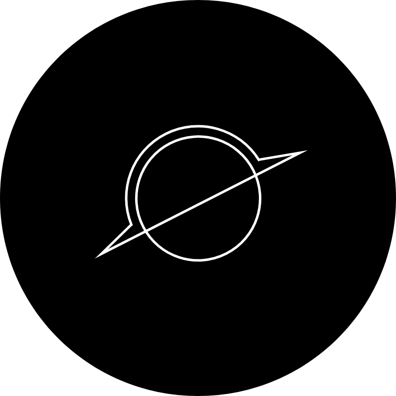

# (Event) Horizon

Horizon is my personal project for understanding and implementing a library that enables event-driven design.
The goal of this package is to provide a bus or communication method that consists of entities that emit events to certain topics, and handlers that act upon those events.
Extensibility will provided by the use of `interfaces` so that users can implement their own custom entities.

## TODO: Installation
## TODO: Usage
## TODO: Considerations